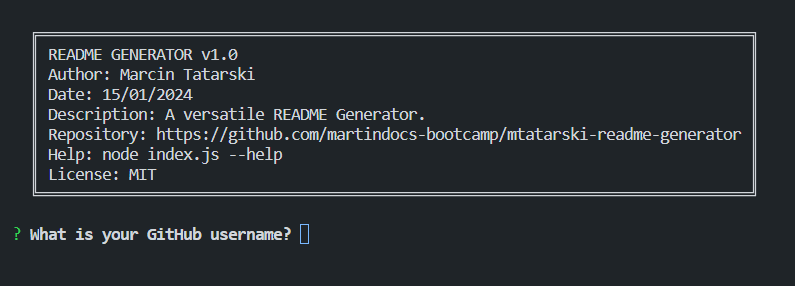

# Profesional Readme Generator 

## Overview

The Readme Generator is a command-line application built to simplify the creation of professional README files for GitHub projects. As a crucial aspect of open source development, a comprehensive README provides vital information to users, contributors, and collaborators. This tool automates the README generation process, allowing project creators to allocate more time to actual development.

The primary tools used include:

- **Node.js (v19.4.0):** powers the Readme Generator, providing a robust JavaScript runtime for executing command-line operations efficiently. 

## Table of Contents
- [Screenshot](#screenshot)
- [Installation](#installation)
- [How to Use](#how-to-use)
- [Dependencies](#dependencies)
- [Features](#features)
- [Tests](#tests)
- [Contributions](#contributions)
- [Troubleshooting](#troubleshooting)
- [Feature Requests and Bug Fixes](#feature-requests-and-bug-fixes)
- [Questions](#questions)
- [License](#license)

## Screenshot



*The Readme Generator main screen.*

## Installation

To use the Readme Generator, follow these steps:

1. Ensure you have [Node.js](https://nodejs.org) installed.
2. Clone this repository to your local machine.

```sh
git clone https://github.com/martindocs-bootcamp/mtatarski-readme-generator.git
```

3. Navigate to the project directory.

```sh
cd mtatarski-readme-generator
```

4. Install dependencies.

```sh
npm install
```

## How to Use


1. Run the application using the following command:

```sh
node index.js
```

2. Answer the prompts to customize your README.
3. Once completed, find the generated README in the `output` folder.
4. For a quick demonstration, you can watch a short video on youtube [▶️ watch a short video](https://youtu.be/CKs7uv3Bqks) showcasing how to use the Readme Generator.

## Dependencies

The following Node.js packages are utilized in this project:

- **Inquirer**: A powerful package for handling user prompts, enabling dynamic input in the command line.
- **Commander**: A module for creating command-line interfaces with a focus on simplicity and extensibility.
- **Minimist**: A minimalist command-line argument parser for Node.js.

```sh
npm install inquirer@6.3.1 commander@11.1.0 minimist@1.2.8
```

## Features

- **Dynamic README and LICENSE Generation:** Create README and LICENSE files dynamically through user input utilizing the Inquirer package.
- **Customization Options:** Tailor your README by easily adding a logo or screenshot to enhance project visibility.
- **Multiple README Support:** Generate multiple README files without overwriting each other. Each file is stored in a uniquely named folder (e.g., YYYYMMDD-HHMMSS).
- **Terminal Banner Display:** Optionally display or hide the terminal banner using the `--banner` or `--nobanner` flag. For example:
   ```sh
   node index.js --banner
   ```
   or
   ```sh
   node index.js --nobanner
   ```

   **Note:** There is a known bug where the banner may not be immediately disabled. If you encounter this issue, try reloading the program or refer to the [Troubleshooting section](#troubleshooting) for more information.
   <br>
- **Development Terminal Help:** Access helpful information about the terminal commands using the `--help` option. For example:
    ```sh
    node index.js --help
    ```

## Tests
```
N/A
```

## Contributions

Contributions are welcome! Here are several ways you can contribute:

- **[Report Issues](https://github.com/martindocs-bootcamp/mtatarski-readme-generator/issues)**: Submit bugs found or log feature requests.

#### *Contributing Guidelines*

<details closed>
<summary>Click to expand</summary>

1. **Fork the Repository**: Start by forking the project repository to your GitHub account.
2. **Clone Locally**: Clone the forked repository to your local machine using a Git client.
   ```sh
   git clone <your-forked-repo-url>
   ```
3. **Create a New Branch**: Always work on a new branch, giving it a descriptive name.
   ```sh
   git checkout -b new-feature-x
   ```

4. **Make Your Changes**: Develop and test your changes locally.
5. **Add Changes to Staging Area**:
   ```sh
   git add -A 
   ```
6. **Commit Your Changes**: Commit with a clear and concise message describing your updates.
   ```sh
   git commit -m 'Implemented new feature x.'
   ```
7. **Push to GitHub**: Push the changes to your forked repository.
   ```sh
   git push origin new-feature-x
   ```
8. **Submit a Pull Request**: Create a PR against the original project repository. Clearly describe the changes and their motivations.

  Once your PR is reviewed and approved, it will be merged into the main branch.

9. **Switch Back to Main Branch and Pull Sync with Main**: If you wish to work on a new feature/change, switch back to the main branch and sync with the latest changes.
  ```sh
  git checkout main
  git pull origin main
  ```
10. **Repeat the Process if Necessary**: Start from point 3 onwards.

</details>

## Troubleshooting
### Banner Display Issue

If you are experiencing an issue where the banner is not properly disabled even when using the `--nobanner` flag, follow these steps to resolve the problem:

1. **Reload the Program:**
   - After changing the `--nobanner` flag, try reloading the program. Sometimes the changes might not take effect immediately.

2. **Check Configuration:**
   - Ensure that the configuration file (`config.json`) reflects the correct values for the `banner` and `nobanner` flags after running the program with the `--nobanner` option.


### Feature Requests and Bug Fixes

We welcome feature requests and bug reports from our users. If you have a suggestion for a new feature or if you encounter a bug, please follow these steps:

1. **Feature Requests:**
   - If you have an idea for a new feature, feel free to open a feature request on the [GitHub repository](https://github.com/martindocs-bootcamp/mtatarski-readme-generator). Provide a detailed description of the proposed feature and why it would be beneficial.

2. **Bug Reports:**
   - If you encounter a bug, please open a detailed bug report on the [GitHub repository](https://github.com/martindocs-bootcamp/mtatarski-readme-generator). Include information about your operating system, Node.js version, and any steps to reproduce the issue.

Our team is dedicated to improving the program and addressing user feedback. Thank you for helping us make it better!

## Questions
If you have any questions, feel free to reach out to me via [GitHub](https://github.com/martindocs).

## License

Please refer to the [LICENSE](./LICENSE.md) file in this repository for details on how this project is licensed.
